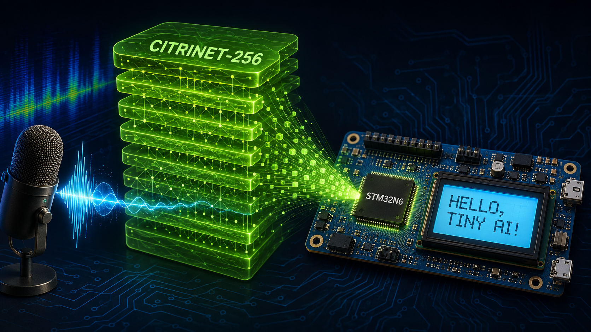
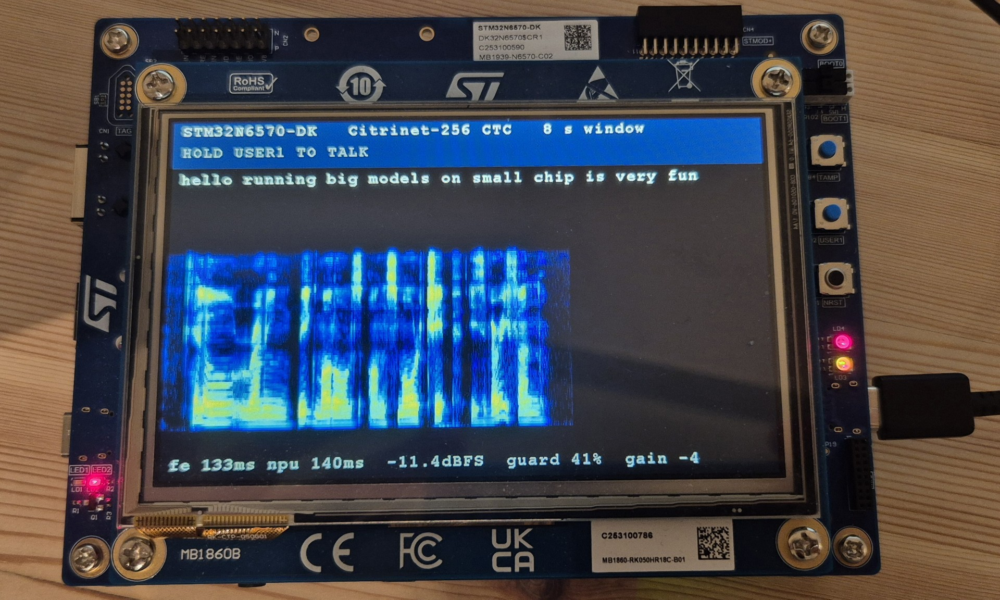

# stm32n6-stt — an on-device speech captioner for the STM32N6570-DK

Push-to-talk English speech recognition running entirely on an STM32N6570-DK:
microphone → log-mel on the Cortex-M55 → **Citrinet-256 CTC encoder on the
Neural-ART NPU** → greedy CTC decode → text on the 800×480 LCD.



<sub>*Artwork, the
real thing is below ;-).*</sub>

### → [**QUICKSTART.md**](QUICKSTART.md) — clone, build, flash, talk

Note before you start: `vendor/` (ST's packages) and `artifacts/` (4.8 GB of
compiler workspaces and a model derived from third-party weights) are **not in
git**. QUICKSTART §1–2 says how to get both. Everything this project *wrote* is
in the clone.

## Status



<sub>An STM32N6570-DK, eight seconds after the button was released. The header is
the idle prompt; below it the transcript of what was just said, then the log-mel
spectrogram the encoder was actually fed, then the status line. Everything on
that line is measured, not estimated: **`fe 133ms`** is the log-mel front end on
the Cortex-M55 and **`npu 140ms`** is the whole Citrinet-256 encoder on the
Neural-ART NPU, both per-invocation cycle-counter reads at 600 MHz.
**`guard 41%`** is the fraction of mel bins below the `2⁻²⁴` log floor — it sits
in the evaluation corpus's own range because push-to-talk zero-fills the tail
(`firmware/FRONTEND.md` §18); before that change every live capture read 0 %.
**`-11.4dBFS`** and **`gain -4`** are where the AGC settled, mid-plateau, with no
`CLIP` flag. The spectrogram is on an absolute scale, so its dark right-hand
third is the zero-filled tail and the blue floor under the speech is the room.</sub>

**Feasibility settled, GO. Gates 0–7b are closed — the project is complete.** The model
has been exported, shape-frozen, quantised to int8 on real speech, compiled
against the STM32N6 audio application's real memory geometry, and scored for
accuracy at the window it will actually ship at. **The full 800-frame
Citrinet-256 encoder now executes on the Neural-ART NPU**, booted from external
flash, in **124.0 ms** — 448 epoch blocks, 0 software epochs, 0 hybrid, every
activation on-chip. Getting there cost two NPU defects, both in depthwise
convolutions, both found on silicon and both fixed; see *On silicon* below.
The on-device front end now runs too. `firmware/src/citrinet_fe.c` costs
**136.0 ms on the M55** — as much as the whole NPU encoder — and agrees with the
host to **six int8 values out of 960,000, each by exactly one LSB**. And on
2026-08-19 the board transcribed live speech from its own microphone:
*"the birch canoe slid on the smooth planks"*, read back verbatim.
See [`firmware/FRONTEND.md`](firmware/FRONTEND.md) §§9-11.

> That 124.0 ms is the invoke with the input tensor already in RAM. The
> 64-utterance corpus run, which reads each tensor from memory-mapped external
> flash immediately before inferring, measures **140.0 ms** median — 13 % more.
> The delivery path costs real time; see `board/GATE4.md` Round 20.

| gate | verdict | the number that decides it |
|---|---|---|
| 1 — int8 vs fp32 WER at 8 s | **PASS** | int8 costs **+0.50 points** (4.91 % → 5.41 %, n=373, 95 % CI [+0.07, +0.94]) against a ~1.0-point pass band |
| 2 — recompile on ST's own mpool + option string | **PASS** | **0 SW / 0 hybrid epochs**, 947,200 B activations, **0 B in hyperRAM**, weights at **0x70180000** |
| 3 — build, sign, flash and boot ST's stock app | **PASS** | our own build runs from external flash: `\| 22 \| 2.07% \| 0.88 \| 1.20 \| 0.00 \|` |
| 4 — the Citrinet graph executes on the NPU | **PASS** | **448 epochs, 0 SW / 0 hybrid, 124.035 ms measured**, 2.1 % under the compiler's own cycle estimate, 0.005 % run-to-run |
| 5 — log-mel front end on the M55 | **open** | host parity is exact (**0 of 768,000** int8 values differ) but nothing has run on the M55; see *Next* |
| 6 — greedy CTC + detokeniser | **PASS** | **0 text disagreements** over 100 utterances / 9,226 characters against `model/fe.py:greedy()` — host-side; the C decoder has not run on the M55 |

Gates 1 and 2 were re-run from scratch by an adversarial verifier and reproduced
exactly — Gate 1 with an independent harness (zero per-utterance disagreements
over 1,200 model-utterance pairs), Gate 2 bit-for-bit from a clean compile. Full
report: [`docs/GATES-1-2.md`](docs/GATES-1-2.md). Gate 3 write-up, including the
working build recipe and the access matrix for this board's two boot modes:
[`board/GATE3.md`](board/GATE3.md).

**The one irreversible step turned out to be already spent — checked, not
assumed.** `fuse_vddio()` is *not* compiled out on the Makefile path
(`stm32n6570_discovery.h:59-61` self-defines `USE_STM32N6570_DK`), so running
even the unmodified ST app permanently programs OTP word 124 bits 15/16 on a
fresh board. A read-only dump of *this* board returns
**word 124 = `0x00018000`** — both bits already set, so the program branch never
runs and Gate 3 carried no irreversible action here. Evidence and the caveats
that remain: [`board/OTP.md`](board/OTP.md).

**Signing needs `-align`, and ST's Makefile omits it.** Without it the signed
header's entry point lands in the middle of `.text`, the FSBL jumps into a
function body, and the part dies before UART init — a perfectly silent board
with correct-looking flash. It cost most of Gate 3 to find. The build recipe and
a two-command pre-flash check are in [`board/GATE3.md`](board/GATE3.md).

The compile result that decides the project:

| window | T | epochs | **SW epochs** | activations | % of audio pool | weights | sched. cycles @1 GHz |
|---|---:|---:|---:|---:|---:|---:|---:|
| 4 s | 400 | 626 | **0** | 306 KB | 20.8 % | 9.677 MB | 73.7 ms |
| **8 s** | **800** | **628** | **0** | **625 KB** | **42.5 %** | **9.728 MB** | **91.2 ms** |
| 12 s | 1200 | 628 | **0** | 1,017 KB | 69.1 % | 9.731 MB | 124.1 ms |

> **These are screening numbers, and Gate 2 moved them.** The table above uses the
> zoo's option string, which includes `--Oauto-sched`. **ST's audio application
> ships without it.** Under ST's own options the 8 s row is **618 epochs, 925 KB,
> 62.8 % of the pool, 91.89 ms** — still 0 SW, still 0 hybrid, still entirely
> on-chip — and the 12 s row **spills 150 KB to PSRAM** while the epoch table
> still reads 0 SW / 0 hybrid. Adding `--Oauto-sched` back reproduces this table
> exactly. Note also that the pool is not fungible: npuRAM6 is at **94.87 %**
> (~23 KB spare) while cpuRAM2 sits at 48.83 %. See [`compile/GATE2.md`](compile/GATE2.md).
>
> **Gate 4 moved them again**, and this table is now history for the 8 s row. The
> graph that ships is the one with both NPU workarounds applied, and it is
> *smaller* than either: **448 epochs, 300 kB cpuRAM2 + 425 kB npuRAM6, 9.726 MB
> of weights at `0x70400000`, 76.0 M estimated cycles.** See *On silicon*.

**Zero software epochs.** Every operator in a full ASR encoder — 503 nodes of
exactly seven types: 282 Conv (107 of them grouped/depthwise), 130 Relu,
23 ReduceMean, 23 Sigmoid, 23 Mul, 21 Add, 1 Transpose — maps to Neural-ART
hardware, at rank 3 (`[1, 80, T]` in, `[1, T/8, 1025]` out). For contrast, the
Whisper-tiny encoder measured on this same board at **10,935 ms** with 184 of
its 391 epochs in software.

Evidence: `compile/reports/*/summary.txt`, ST Edge AI Core v4.0.1-20581.
See [`docs/FEASIBILITY.md`](docs/FEASIBILITY.md) for the full assessment,
including what the original plan got wrong.

## On silicon

**The compiled graph did not run as compiled.** Two Neural-ART defects, both in
depthwise convolutions, had to be found on the board and then worked around in
the ONNX graph. Both workarounds are bit-exact and neither costs anything:

| # | the defect | the fix | the cost |
|---|---|---|---|
| 1 | a **stride-2 depthwise** convolution stalls the NPU forever. The stall follows the operator across two compiler schedules, so it is not a scheduling artefact | fold the decimation into the pointwise convolution that follows it — with dilation 1 the stride-2 output at *i* is the stride-1 output at *2i*, and the Q/DQ between them commutes with decimation (`model/fold_stride2.py`) | none. 3 sites, 0 of 3,075,000 output elements differ over 30 random inputs |
| 2 | an **activation accelerator driving a convolution accelerator's data port** through the stream switch stalls forever — `ACTIV 1 → CONVACC 0/1/2 port 0`, at 36 sites. atonn produces it when a `Reshape` separates a `Relu` from its producing convolution, so the compiler chains the `Relu` *forwards* into its consumer instead of backwards | keep the `Relu` on the 4-D tensor, so atonn's own `fuse_consecutive_reshapes` cancels the pair it inserted and the `Relu` ends up adjacent to its producer (`model/break_relu_chain.py`, 84 sites, discovered rather than hardcoded) | none, and it is **faster than the graph that stalled**: 448 epochs against 618, 300 kB of cpuRAM2 against 500 kB, 76.0 M estimated cycles against 92.5 M |

Both are verified `max|diff| = 0` over 3,075,000 output elements. The check is
sensitive: flipping one LSB of one int8 weight makes it report `max|diff| = 3.45`.
Blocker 2 has a **9-node, 2,453-byte** reproducer for ST, beside a 6-node control
that differs in nothing else: [`board/REPRO-blocker2.md`](board/REPRO-blocker2.md).

The deployed build is `artifacts/compile/r19_relu4dall84/`:

| | |
|---|---|
| epochs | **448** — 0 pure-software, 0 hybrid |
| activations | 300 kB cpuRAM2 + 425 kB npuRAM6, **0 B in hyperRAM**, no PSRAM |
| weights | **9.726 MB** in octoFlash at `0x70400000` |
| measured | **124.035 ms** — 74,421,588 cycles on the M55's 600 MHz DWT counter, **2.1 % under** the compiler's 76,000,592-cycle estimate |
| run-to-run | **0.005 %** across the 15 invokes in `board/traces/round19_relu4d_pass.log` |

**The arithmetic is deterministic and schedule-independent.** Two builds that
share almost nothing — 1064 epochs with every buffer forced through memory, and
the 448-epoch rewrite chained through the stream switch — give **one distinct
100-token output** across all 23 fully captured runs — 9 and 14 respectively
(`board/traces/round18_forcemem_pass.log`, `round19_relu4d_pass.log`; the
latter records 15 invokes, the last cut off mid-line). Whatever
residual disagreement the device has with the host, it is stable and it does not
move when the schedule changes.

Full record round by round — including the six rounds spent on a boot theory
that was wrong, and the epoch numbers Rounds 9–17 quoted two too low:
[`board/GATE4.md`](board/GATE4.md). Build, sign, flash and read:
[`board/BUILD.md`](board/BUILD.md).

## The model

[`OpenVoiceOS/stt_en_citrinet_256_gamma_0_25_onnx`](https://huggingface.co/OpenVoiceOS/stt_en_citrinet_256_gamma_0_25_onnx)
— a pre-exported ONNX of NVIDIA NeMo's
[`stt_en_citrinet_256_gamma_0_25`](https://catalog.ngc.nvidia.com/orgs/nvidia/models/stt_en_citrinet_256_gamma_0_25),
CC-BY-4.0. **NeMo and PyTorch are not required.**

- ~10 M parameters, 9.7 MB int8, streams from octoFlash
- 80-bin log-mel in, 1025-class CTC logits out (1024 SentencePiece unigram + blank)
- subsampling factor 8 → one output frame per 80 ms
- `kernel_size_factor: 0.25` (that is what `gamma_0_25` means — scaled temporal
  kernels, verified at `docs/nemo_model_config.yaml:30`)

## Deployment contract

Read off the generated `stai_network.h` (`compile/reports/g800_real/io_contract.h`):

| | format | shape | bytes | scale | offset |
|---|---|---|---:|---|---:|
| input | `STAI_FORMAT_S8`, `CHANNEL_FIRST` | `{80, 800, 1}` | 64,000 | 0.120522417128086 | 0 |
| output | `STAI_FORMAT_S8`, `CHANNEL_FIRST` | `{100, 1025, 1}` | 102,500 | 0.265415638685226 | 0 |

Both scales are **per-tensor**, so greedy CTC runs directly on the int8 logits —
argmax needs no dequantisation. Vocabulary is the fast axis. Read the scale at
runtime from `stai_network_get_inputs()[0]` rather than hardcoding it.

**The two graph rewrites did not change this contract.** The deployed build's
`stai_network.h` (`artifacts/compile/r19_relu4dall84/st_ai_output/stai_network.h:328-391`)
carries the same formats, the same shapes and the same two scales, and the board
reads `scale=8.297212 = 1 / 0.120522417128086` back at runtime.

## Layout

```
QUICKSTART.md  clone -> build -> flash -> talk. Start here.
env.sh         where the external tools live; every script sources it

model/      graph surgery, quantisation, the two NPU workarounds, and the NumPy
            reference frontend (fe.py is the C implementation's spec AND its
            test oracle; fe_reference.py carries each constant's provenance)
eval/       WER harness — window, int8, SNR, reverberation, gain, frontend ablation
eval/results/  measured outputs of the above
compile/    the audio-pool mpools + profile, the compile driver (gen_model.sh),
            the build scorer (score_build.py), and per-window compile evidence
firmware/   build.sh (build + sign, four profiles), the C front end and C decoder,
            their generators and host tests, the file-level work list, and
            vendor-mods/gate4.patch — which IS the application
firmware/lcd/  the nine LCD files grafted from ST's ObjectDetection package,
            in that package's directory layout so their relative #includes work
board/      the build/sign/flash recipe, flash_and_verify.sh (writes and reads
            back), the Gate 3 and Gate 4 records, the blocker-2 reproducer, and
            the raw UART traces behind every board claim
tokenizer/  1025-piece vocabulary and the SentencePiece model
docs/       the feasibility assessment and upstream provenance
zoo-contrib/  findings written up for the deployment-zoo this work fed back into

vendor/     (NOT in git) ST's two application packages — QUICKSTART §1
artifacts/  (NOT in git) ONNX graphs, weights, per-tag compile workspaces, the
            corpus blobs, signed board images — QUICKSTART §2
```

## Accuracy, measured on the host

LibriSpeech dev-clean, ONNX Runtime, through the verified NeMo-exact frontend.
These are **not** board measurements.

- int8 vs fp32 at **8 s**, the shipped window: 4.91 % → **5.41 %** WER
  (+0.50 points, 95 % CI [+0.07, +0.94]) on 373 utterance-disjoint utterances
  that fit the window — `eval/results/gate1_8s.json`, [`eval/GATE1.md`](eval/GATE1.md)
- int8 vs fp32 at 4 s: 5.60 % → **6.09 %** WER (+0.49 points) — `eval/results/int8.json`
- window vs full spoken reference, 150 natural-length utterances:
  4 s **47.7 %**, 6 s 30.4 %, 8 s **20.0 %**, 12 s 9.0 % — truncation, not
  misrecognition. Word coverage 0.56 / 0.73 / 0.84 / 0.95.
- babble noise is the one that hurts: 60.1 % WER at 5 dB SNR — `eval/results/snr.json`

**The gain-staging landmine.** At −54 dBFS input — which is where ordinary
desk speech lands on the DK's MP23DB01HP microphone — 97.9 % of mel bins fall
below NeMo's `log_zero_guard` and WER goes **5.83 % → 35.28 %** while every log
reports a clean NPU run. Peak-normalising the captured buffer to 0.9 restores
5.83 %. Applying that gain *after* int16 truncation only recovers to 10.45 %,
so it has to happen in the PDM/MDF decimator. See `eval/results/gain.log`.

## Accuracy on the device

64 dev-clean utterances — 844 reference words, 6,400 frames, the shipped graph's
own calibration set excluded — fed to the board as **host-computed** int8
features and scored host-side. Utterance 0 is byte-identical to the canned tensor
every earlier board run used, so the corpus run carries its own control and
reproduces it exactly. Trace and full score in `board/traces/round20_corpus64.*`.

| | S | I | D | errors | words | WER | bootstrap 95 % |
|---|---:|---:|---:|---:|---:|---:|---|
| host vs reference | 45 | 4 | 1 | 50 | 844 | **5.92 %** | [3.99, 8.04] |
| device vs reference | 42 | 3 | 4 | 49 | 844 | **5.81 %** | [3.91, 7.79] |

Paired per utterance — the right test, because it removes the model's own errors
— the corpus WER difference is **−0.118 points**, bootstrap 95 %
**[−1.290, +1.144]**, **p = 0.897**; worse on 6 utterances, better on 10, tied on
48. Per-frame argmax disagreement is **2.41 %**, and it sits exactly where the
host is nearly undecided: **6.25× enriched** in the tightest decile of host
top1−top2 margin and **zero** in the widest 20 %. **70.8 % of disagreeing frames
(109 of 154) are blank-placement shifts that CTC collapses away.** 17 host frames
(0.27 %) are **exact argmax ties**, where any arithmetic difference flips the
token by index order alone.

**What this does not license.** "No difference" is *not* established — the
interval is 2.43 points wide, so any true difference smaller than that is
invisible at n = 64. It is one corpus (clean read speech ≤ 7.69 s) and one decode
(greedy CTC); nothing here speaks to noise, other speakers, or beam search. And
it uses **host-computed features**, so it isolates the NPU and says nothing about
the on-device front end.

## What is left

**Nothing is blocking. Every gate is closed and the board works.** What follows
is the honest list of what a next session would pick up, in the order I would
pick it up.

1. **Accuracy is a model problem, not a port problem.** Live free-form speech
   from an accented speaker measures ~30 % WER, against 3.2 % for LibriSpeech
   played at the same microphone and 4.3 % for host-computed features. Level,
   int16 quantisation, SNR, reverberation and the front end are each ruled out by
   measurement (`firmware/FRONTEND.md` §§12–15), and the fp32 reference model
   makes the same errors on the same audio (§15). The fix is a fine-tuned or
   multi-accent Citrinet — and because `model/fold_stride2.py`,
   `model/break_relu_chain.py` and `compile/gen_model.sh` work on graph structure
   rather than weights, a new checkpoint re-runs the identical pipeline with **no
   firmware work at all**.
2. **Report the two NPU defects to ST.** `board/REPRO-blocker2.md` is a 9-node
   reproducer for the second one. Neither is documented, both compile cleanly and
   report 0 software epochs, and both hang the part forever.
3. **Streaming.** The design is one 8 s window at a time. A sliding window with
   overlap-and-discard would give continuous captioning; the front end already
   has the incremental entry points (`citrinet_fe_column`, `citrinet_fe_finish`)
   that `firmware/WORKLIST.md` §5.7 was written around.
4. **The 800-frame window is a choice, not a constraint.** 4 s and 12 s graphs
   are quantised and scored (`model/q1200.py`, `quant_real.py`); 12 s costs
   proportionally more NPU time and 4 s less.
5. **Untouched by design:** touch (no GT911 driver exists in either ST package),
   the FreeRTOS and low-power build variants, and USB audio.

### The gate history, kept because the reasoning is worth reading

Gates 0–7 are closed, Gates 5 and 7 both on 2026-08-19. **The transcript is on
the 800×480 panel** — a blue header, the decoded text word-wrapped in Font20, and
a live stats line (`fe 133ms npu 140ms  -5.0dBFS  guard 0%  gain 2`). The LCD
needed no PSRAM: AXISRAM3/4/5 are contiguous and the mpool claims none of them,
so the 768,000 B framebuffer sits at `0x34200000` with the audio buffers above
it. **7b is closed too**: hold `USER1`, speak, release. The take ends on release and
the tail is zero-filled, which moved guard occupancy from 0 % to 47–63 % against
the evaluation corpus's 35.6 % — the first change that closed a gap against the
model's *training* distribution rather than against the instrumentation
(`firmware/FRONTEND.md` §18).

### What Gate 5 actually cost, against what this section predicted

The three obstacles below were the plan of record. All three are resolved, and
the third was **not real**:

1. ~~**It has never run on the M55.**~~ **136.0 ms**, measured — 81.5-81.7 M
   cycles at 600 MHz, against 140.1 ms for the NPU. The front end is half the
   latency budget, not a rounding error on it. Parity on silicon is six int8
   values of 960,000, each one LSB (`firmware/FRONTEND.md` §11).
2. ~~**The stock capture path does not fit in RAM.**~~ Sidestepped rather than
   solved: the utterance design needs no ring buffer at all, and the two 256,000 B
   buffers live in **AXISRAM3 and AXISRAM4** (`0x34200000`, `0x34270000`), which
   the linker script never declares and the mpool never claims. The application's
   own 1023 K region is untouched and links at 82 %.
3. ~~**Gain staging is unsolved, and it fails silently.**~~ **The premise was
   wrong by about 50 dB.** The −54 dBFS figure below is not what this board's
   microphone delivers. At the stock `MDF_GAIN(16000) = 2` it produced a
   **−3.8 dBFS peak with zero clipped samples**. There *is* a gain-staging
   problem, but it has **the opposite sign**: at that same gain a louder talker
   clipped 1067 of 128,000 samples and scored **62.5 % WER**, the worst figure
   measured anywhere in this project. The AGC exists to bring the level *down*
   and hold it there against a talker who moves
   (`firmware/FRONTEND.md` §13). Measured WER against capture level, on canned
   material peak-scaled: **flat at 6–8 % from −3.8 down to −30 dBFS**, 9.7 % at
   −40, 18.1 % at −54. The mechanism at the bottom is the **log guard**, not the
   int16 truncation — truncating to int16 costs ±1.4 points with no trend at any
   level, so **quantisation noise is not a factor**
   (`firmware/FRONTEND.md` §12). The AGC targets a −7.6 dBFS peak, mid-plateau;
   `CITRINET_FE_GUARD_MAX_FRAC` first fires at −30 dBFS, exactly where the curve
   turns.

**The microphone path costs nothing measurable.** Two LibriSpeech utterances
played at the board through a laptop speaker score **3.2 % WER** through
mic → MDF → M55 front end → NPU, against **4.3 %** for the same model fed
host-computed features from flash — one of them transcribed verbatim. Live human
speech pools at **30.3 %**, and that gap is the talker being outside
Citrinet-256's LibriSpeech training distribution, not the port: level, int16
quantisation, SNR (33.6 dB measured), reverberation (RT60 0.09 s) and the front
end (6 int8 values of 960,000) were each eliminated by measurement first. See
[`firmware/FRONTEND.md`](firmware/FRONTEND.md) §§9-15 — and §§10-14 for four
hypotheses of mine the board refuted.

### The original text, kept because the reasoning is still worth reading

2. **The stock capture path does not fit in RAM, by 2.6x.** At `COL = 800` the
   vendor app's buffers come to about **2,679,312 B** against a **1,047,552 B**
   region, and `AudioBM_proc_t` alone exceeds it by 2.07x — so it fails at
   **link** time. Most of that is not the capture buffers at all: it is the two
   `pCplxSpectrum` arrays inside `audioPreCtx` and `audioPostCtx`, 822,400 B
   each. Gate 5 therefore has to **replace** ST's pre/post-processing contexts
   rather than resize anything, which is what the utterance-based design wants
   anyway — `firmware/src/citrinet_fe.c` is self-contained and uses neither,
   and `firmware/FRONTEND.md` §7 budgets the replacement at 135-518 kB. The
   current build links at 62 % only because `ai_model_config.h:47` still carries
   the AED model's `COL = 96`.
3. **Gain staging is unsolved, and it fails silently.** At −54 dBFS — where
   ordinary desk speech lands on the DK's microphone — 97.9 % of mel bins fall
   below NeMo's log guard and WER goes **5.83 % → 35.28 %** while every log
   reports a clean NPU run (`eval/results/gain.log`). The gain has to be applied
   in the MDF/PDM decimator: applying it after the int16 truncation only recovers
   to 10.45 %.

   > **The simulation is sound; the −54 dBFS input to it is not.** Measured on
   > silicon 2026-08-19: the DK's MP23DB01HP through MDF1 at the stock gain of 2
   > gives a **−3.8 dBFS peak, −23.5 dBFS RMS, 0 clipped samples** and 0 % guard
   > occupancy. Roughly 50 dB hotter than assumed. The *conditional* — if you feed
   > it −54 dBFS, WER goes to 35 % — is still true, and is still the reason the
   > guard telemetry exists; it was simply never the operating point. What is
   > confirmed is the second half: `citrinet_fe_peak_normalize()` rescued a
   > −25.7 dBFS capture from 66 % guard to 3 % and halved its errors, but never
   > beat a correctly-gained one (`firmware/FRONTEND.md` §10).

> **Corrected.** 1,026,240 B is `firmware/WORKLIST.md` §5.4's figure and it is a
> **2.6x undercount**, because it counts `proc_buff` + `audio_out` + the ring buffer
> and stops. `AudioBM_proc_t` also holds **two** processing contexts — `audioPreCtx`
> and `audioPostCtx` (`Projects/GS/Inc/audio_bm.h:61-62`) — and each carries
> `pCplxSpectrum[(NFFT/2+1)*2*COL]` of `float16_t` (`Projects/Dpu/audio_proc.h:64`,
> NFFT 512). At COL 800 that is 257x2x800x2 = **822,400 B each, 1,644,800 B for the
> pair**, giving ~**2,679,312 B** against a 1,047,552 B region.
> The derivation is checked against the stock geometry: at COL 96 it yields
> **268,048 B**, which is exactly the number `audio_bm.h:50` already records.
> Two consequences: the overrun is 2.6x rather than marginal, and it fails at
> **link** time, not in a runtime `malloc` as previously stated — `AudioBM_proc_t`
> alone exceeds the region by 2.07x. Gate 5 must therefore **replace** ST's
> pre/post-processing contexts, not resize the capture buffers; `citrinet_fe.c` is
> already self-contained and uses neither. Note the current build links at 62 %
> only because `ai_model_config.h:47` still carries the AED model's COL 96.

Gate 7 (the LCD graft) and 7b (the button) follow, and neither can fail in a way
that invalidates the model. Everything is planned to file level in
[`firmware/WORKLIST.md`](firmware/WORKLIST.md); gate definitions in
[`docs/FEASIBILITY.md`](docs/FEASIBILITY.md#work-plan); what changed since that
document was written is in [`docs/GATES-1-2.md`](docs/GATES-1-2.md) §2 and
[`firmware/WORKLIST.md`](firmware/WORKLIST.md) §0.

## Licence

**[Apache-2.0](LICENSE)** for everything this project wrote — the firmware, the
graph rewrites, the compile driver, the host tooling and the documentation.
Chosen over MIT for its explicit patent grant, and compatible with the
BSD-3-Clause and Apache-2.0 components alongside it.

The nine LCD files in `firmware/lcd/` are STMicroelectronics' under
**BSD-3-Clause**, and the tokenizer and model derive from NVIDIA's Citrinet-256.
[`THIRD-PARTY-NOTICES.md`](THIRD-PARTY-NOTICES.md) has the per-file detail,
including why `artifacts/` is not redistributed here and why one ST file was
deleted rather than shipped.

## Related

[`stm32n6-deployment-zoo`](https://github.com/LarocheC/stm32n6-deployment-zoo) —
the screening funnel this model was validated against. The zoo answers "will an
arbitrary graph run on this part"; this repo answers "does this product work for
a person."
